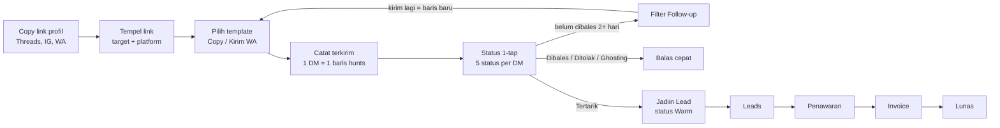
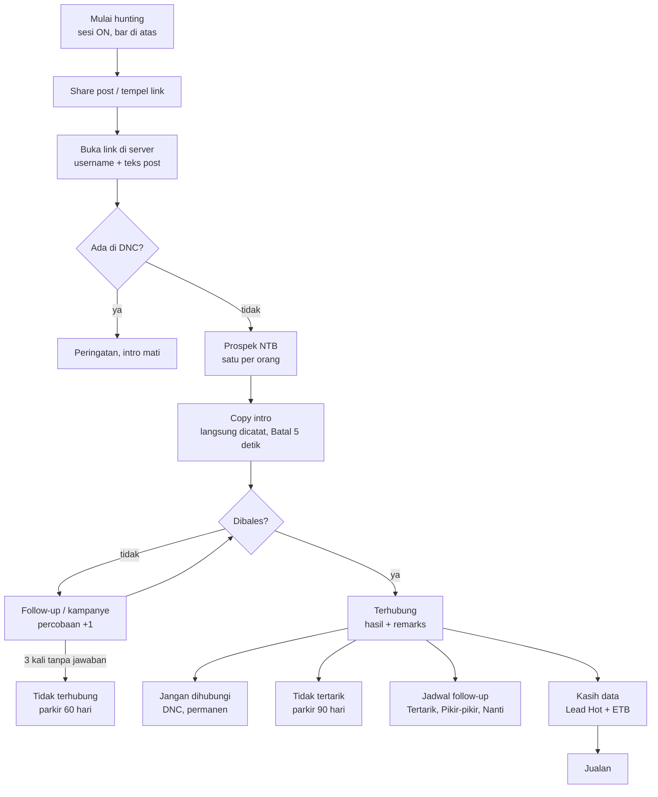
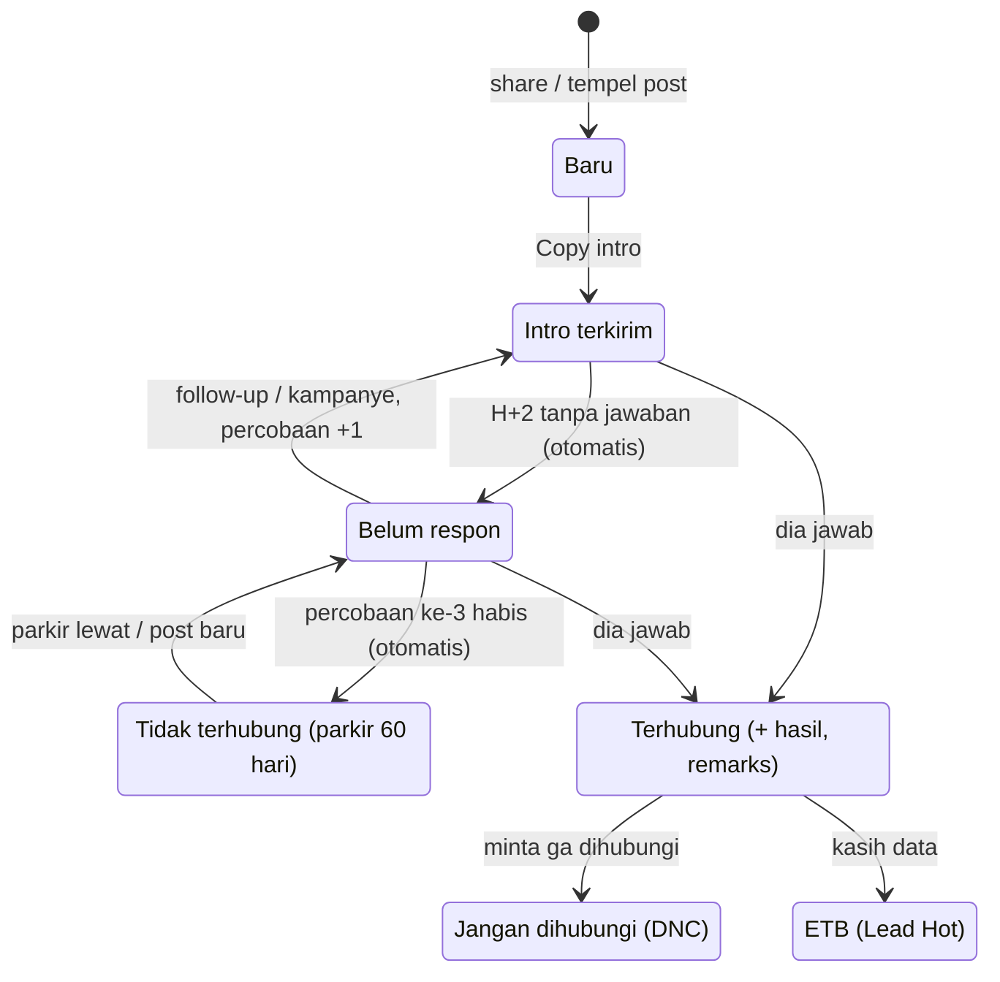
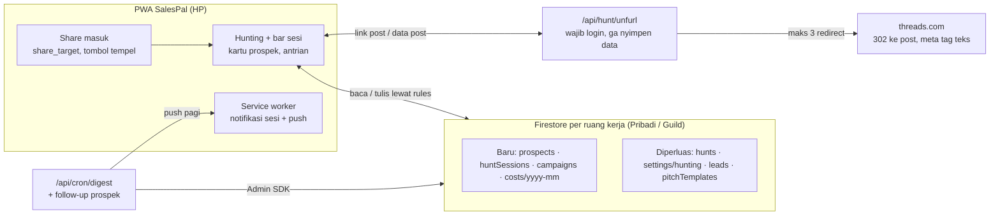

# PRD-009 — Sesi Hunting & Journey Prospek (NTB → ETB)

- **Status:** Dibangun 2026-10-10 — Fase 0–2 penuh + metrik & biaya Fase 3 (`lib/prospects.ts`, `lib/prospectStore.ts`, `components/{HuntBar,ProspectList,Campaigns,HunterStats}.tsx`, `app/api/hunt/unfurl`, `app/share`). Belum: Document Picture-in-Picture desktop. Live butuh deploy `firestore.rules` (4 koleksi baru).
- **Tanggal:** 2026-10-10
- **Konteks:** Pas hunting, owner share post Threads orang yang lagi nyari jasa (contoh: *"ada yang open jasa foto katalog F&B buat UMKM?"*) → orang itu harus langsung masuk basis lead, CTA/intro siap di-copy, dan semua yang terjadi sesudahnya (intro, follow-up, kampanye, balasan, remarks) kecatat sebagai satu riwayat. Polanya dipinjam dari sales/telemarketing perbankan: tiap nasabah punya **disposisi** (terhubung atau belum → hasil → remarks), ada **contact strategy**, dan dari situ keluar metrik performa hunter-nya.
- **Terkait:** PRD-002 (Hunting), PRD-003 (Radar Threads), PRD-008 (desain baru, profil customer, skor potensi), PRD-005 §7 (aturan tampilan angka), PRD-007 §2.5–2.6 (ruang kerja, Perlu Ditindak, push), `lib/hunting.ts`, `lib/replies.ts`, `lib/space.ts`.
- **Diagram & diskusi:** [Master Flow Hunting & Journey Prospek](https://claude.ai/code/artifact/67dd1690-74ec-4686-8179-7b2cf80fe9f5) (artifact private, buat diskusi). Kalau beda, **dokumen ini yang berlaku**.

---

## 1. Masalah & insight

Hunting sekarang = **log per DM** (`hunts`: target, template, status). Itu cukup buat ngukur template, tapi:

1. **Satu orang dikontak 4× sebulan = 4 baris lepas.** Ga ada "posisi" orang itu sekarang, ga ada jawaban "butuh berapa kali kontak sampai dia respon".
2. **Post asal ga kesimpen.** Padahal post "ada yang open jasa X?" itu bukti niat beli — konteks paling penting buat intro dan buat ngukur sumber mana yang bagus.
3. **"Ditolak" nyampur tiga hal beda:** "nanti dulu", "ga butuh", dan "jangan hubungi gue lagi". Yang terakhir harus dikunci, dua yang pertama masih bisa dikontak lagi bulan depan.
4. **Ga ada mode "lagi berburu".** Ga ketauan berapa lama sesi, berapa intro per jam, sesi mana yang produktif.
5. **Ngetik ulang.** Buka post → salin username → tempel → pilih platform. Link share Threads (`/share/…`) malah kebaca "Lainnya" sama `parseProfile`.

**Insight:** pisahin **orang** (prospek, satu journey) dari **pesan** (hunt, satu kiriman). Pesan tetap ngukur template; orang ngukur hunter-nya — contact rate, percobaan sampai respon, konversi NTB → ETB, biaya per konversi.

### Alur sekarang (as-is, sebelum PRD ini)



### Catatan istilah (biar angka ga salah baca)

- **Terhubung / contacted** = dia **jawab**, apa pun jawabannya. "Tidak tertarik" itu *terhubung* dengan hasil negatif, bukan *tidak terhubung*.
- **Tidak terhubung / not contacted** = udah dicoba sampai batas percobaan, **ga ada jawaban sama sekali**.
- **NTB (new to business)** = belum pernah kasih data / beli. Semua yang masuk dari post, Radar, atau tambah manual.
- **ETB (existing to business)** = udah kasih data (konversi) atau udah jadi klien. Dari sini kampanye ke dia = jaga hubungan / repeat, bukan akuisisi.

---

## 2. Tujuan / Non-tujuan

**Tujuan**
- G1: Hunting Mode punya tombol **ON**. Selama ON ada **bar panel di atas** yang nempel di semua tab (timer, hitungan, tempel link, akhiri) sampai dimatiin.
- G2: **Share / tempel link post Threads → satu prospek** (username, nama, teks post, link) tanpa ngetik.
- G3: **Satu prospek = satu journey.** Riwayat aksi kebaca kayak chat: post dia, intro lu, balasan dia, remarks.
- G4: **Disposisi gaya sales** — status kontak + hasil + remarks, contact strategy otomatis, **DNC dikunci permanen**.
- G5: **Metrik hunter** — contact rate, percobaan & hari sampai respon, konversi NTB → ETB, per template / kampanye / channel / sesi, biaya per konversi.
- G6: **Biaya tiap komponen ketahuan** (§10) dan biaya operasional **dicatat di app**, jadi CPL & biaya per konversi kehitung.

**Non-tujuan**
- Ga auto-DM / auto-comment (ToS, PRD-002).
- Ga baca DM otomatis — Threads ga punya API DM (PRD-003 §1). Balasan dicatat manual: tempel teksnya atau tap status.
- Ga beli / enrich nomor & email dari pihak ketiga. Data kontak = **dikasih sendiri** sama prospek (itu yang dihitung konversi).
- Ga nampil di atas app Threads — PWA ga bisa gambar di atas app lain (§4.3).

---

## 3. Alur (dari case owner)

1. Buka **Hunting** → **▶ Mulai hunting**. Bar panel muncul di atas, status bar HP ikut berubah warna.
2. Di Threads ketemu post "nyari jasa foto katalog". **Share → SalesPal** (Android) atau **Copy link** → tap **📋** di bar (semua HP).
3. SalesPal buka link-nya di server (§5): dapet `@username`, nama, teks post, link post. Prospek baru: **NTB · Baru**, riwayat pertama = post dia.
   - Username udah ada → buka prospek yang sama, post baru ditambah ke riwayat (ga dobel).
   - Username ada di **DNC** → peringatan "Orang ini minta ga dihubungi", tombol intro mati.
4. Kartu prospek nampilin post + **CTA/intro siap copy** (`{nama}` terisi) dan pilihan channel: **Balas di post** atau **DM**. Tap **Copy intro** → pesan tersalin **dan** dicatat **Intro terkirim** (percobaan 1), dengan tombol **Batal** 5 detik kalau ternyata ga jadi dikirim. Lalu **Buka post ↗ / Buka profil ↗**.
5. Ga ada balasan → H+2 otomatis **Belum respon**, masuk antrian follow-up. Kirim follow-up / kampanye = percobaan 2, 3.
6. Dia bales → tap **💬 Dibales** (opsional tempel teks balasannya — masuk riwayat dan dipakai Balas cepat buat nebak keberatan). Pilih hasil: Tertarik / Pikir-pikir / Hubungi nanti / Tidak tertarik (+ alasan) / Menolak dihubungi / **Kasih data**.
7. **Kasih data** = konversi: isi minimal (nama bisnis, WA atau email) → jadi **Lead Hot** di Leads, prospek pindah **ETB**. Dari situ jalan di Jualan (penawaran → invoice → lunas) seperti biasa.
8. 3 percobaan tanpa jawaban dalam 30 hari → otomatis **Tidak terhubung**, diparkir 60 hari. Tidak tertarik → diparkir 90 hari. Menolak dihubungi → **DNC selamanya**.
9. **■ Akhiri** → ringkasan sesi: durasi, prospek masuk, intro, dibales, konversi, intro per jam.



---

## 4. Sesi hunting & bar panel

### 4.1 ON / OFF
- **▶ Mulai hunting** di tab Hunting. Bikin `huntSessions/{id}` `{ startedAt, lastActionAt, endedAt: null, counts }`; sesi aktif = yang `endedAt`-nya masih kosong, jadi bar tetap ada setelah reload / pindah device. (Bukan di `settings/hunting`: di guild itu katalog yang cuma bisa ditulis Leader/Officer, sedangkan sesi milik tiap orang.)
- Semua prospek, intro, dan status yang dibuat selama ON dapat `sessionId`.
- **■ Akhiri** nutup sesi (`endedAt`, hitungan dibekukan). Sesi yang lupa dimatiin auto-tutup setelah 30 menit tanpa aksi (durasi dihitung sampai aksi terakhir, biar intro/jam ga rusak).

### 4.2 Isi bar (nempel di atas, semua tab)
```
● Hunting 23:14 · 6 intro · 2 dibales · 1 data     [📋] [Antrian 4] [■]
```
- **📋** = tempel link dari clipboard → langsung jadi prospek (§3 langkah 3).
- **Antrian** = follow-up yang jatuh tempo + kampanye yang lagi jalan (§7), satu per satu.
- Progress ke target harian (`settings/hunting.dailyGoal`) jadi garis tipis di bawah bar.
- `<meta name="theme-color">` diganti ke warna hunting selama ON → status bar Android / PWA ikut berubah. Balik normal pas Akhiri.
- Mobile: tinggi ≤ 48px, aman dari notch (`env(safe-area-inset-top)`), ga nutup header.

### 4.3 Batas platform (penting buat ekspektasi)
| Device | Yang bisa | Yang ga bisa |
|---|---|---|
| Android (PWA terpasang) | bar di dalam SalesPal; **share target** (Share → SalesPal); **notifikasi sesi** dari service worker ("Hunting aktif · 6 intro · ketuk buat balik"), diperbarui tiap aksi, tanpa server push | bar nampil di atas app Threads |
| iPhone (PWA terpasang) | bar di dalam SalesPal; **Copy link** di Threads → tombol 📋 di bar | share target (Safari belum dukung Web Share Target); Shortcut iOS ga dipakai karena link dari Shortcut kebuka di Safari, yang login-nya terpisah dari PWA; notifikasi lokal tanpa push |
| Desktop Chrome / Edge | bar; **Document Picture-in-Picture**: mini panel ngambang di atas tab Threads web (fase 3) | — |

### 4.4 Share masuk
- Satu manifest cuma boleh satu `share_target`. Yang dipakai punya PRD-008: `POST /share-target` (multipart), ditangkep `public/sw.js`. Ada file (export WhatsApp) → import WA; ga ada file tapi ada link di `url`/`text`/`title` → `/dashboard?hunt&url=…`. `app/share` tetap ada sebagai pintu GET (bookmarklet, flow test).
- `Hunting.tsx` buka link itu: post Threads → `/api/hunt/unfurl` → prospek. Prospek tetap disimpan walau sesi belum ON.

---

## 5. Buka link Threads tanpa API (gratis)

Dicek 2026-10-10:
- `threads.com/share/{kode}/` → **302** ke `threads.com/@{username}/post/{postId}?…`. Username + id post dapet dari header `Location` doang.
- HTML-nya (user agent crawler link preview) punya `og:title` = `"Nama (@username) on Threads"` dan `og:description` = **teks post utuh**.

**Route `/api/hunt/unfurl`** (Vercel function):
- **Wajib login** lewat `lib/serverAuth.ts` (pelajaran `/api/scan`, PRD-006 B1).
- Host allowlist `threads.com` / `threads.net` / `www.` saja; ikutin redirect maks 3 kali dan **tiap hop dicek ulang ke allowlist** (cegah SSRF). Timeout 5 detik.
- Balikin `{ handle, name, text (≤ 500 karakter), postUrl, postId }`. Parameter tracking (`xmt`, `slof`) dibuang dari `postUrl`.
- **Ga nyimpen `og:image`** — URL CDN-nya kedaluwarsa dan isinya foto orang.
- Gagal baca HTML → tetap balikin handle dari redirect. Gagal total → isi username manual (alur lama).
- Satu request per aksi user, ga ada crawling. Datanya sama dengan yang dipakai preview link di WA/Telegram.
- Link profil biasa (`/@user`) dan IG/WA tetap lewat `parseProfile` di client, tanpa server.

---

## 6. Journey & disposisi

### 6.1 Status kontak
| Status | Arti | Masuk |
|---|---|---|
| **Baru** | post masuk, belum di-intro | otomatis saat share / tempel |
| **Intro terkirim** | intro/CTA udah dikirim, nunggu | otomatis saat Copy intro |
| **Belum respon** | ada percobaan, lewat 2 hari ga ada balasan (`STALE_DAYS`) | otomatis / manual |
| **Tidak terhubung** | percobaan habis tanpa jawaban | otomatis, parkir 60 hari |
| **Terhubung** | dia jawab | manual (tap / tempel balasan) |
| **Jangan dihubungi (DNC)** | minta ga dihubungi | manual, permanen |

### 6.2 Hasil + remarks (cuma kalau Terhubung)
| Hasil | Efek |
|---|---|
| **Tertarik** | follow-up besok, masuk Perlu Ditindak |
| **Pikir-pikir** | tanggal follow-up (default +3 hari) |
| **Hubungi nanti** | tanggal yang dia sebut |
| **Tidak tertarik** | alasan = topik keberatan di `lib/replies.ts` (Harga, Sudah punya, Nanti dulu, Lagi sibuk, Belum yakin) + teks bebas; parkir 90 hari |
| **Menolak dihubungi** | jadi DNC (§6.4) |
| **Kasih data ✅** | konversi → Lead Hot + ETB, `convertedAt` |

Status `hunts` yang lama tetap jalan buat eval template dan dipetakan ke prospek: Terkirim → Intro terkirim, Dibales → Terhubung, Tertarik → Tertarik, Ditolak → Tidak tertarik (remarks = catatan), Ghosting → Belum respon.

### 6.3 Contact strategy (default, bisa diubah di `settings/hunting`)
- **Percobaan** = intro, follow-up, atau kirim kampanye yang ga dijawab sejak jawaban terakhir. Jawaban apa pun nge-reset hitungan.
- Ritme: H+0 intro → H+2 follow-up → H+7 follow-up / kampanye. **Maks 3 percobaan tanpa jawaban per 30 hari**, lalu Tidak terhubung.
- Prospek yang diparkir ga muncul di antrian & kampanye sampai `parkedUntil` lewat. Kebuka lagi otomatis kalau dia post lagi dan di-share ulang.
- Jatuh tempo (follow-up, Pikir-pikir, Hubungi nanti) masuk panel **Perlu Ditindak** dan push pagi yang udah ada (PRD-007 §2.6).

Garis "(otomatis)" dihitung dari tanggal saat dibaca, tanpa cron: ga ada tulisan ke database sampai lu ngelakuin sesuatu.



### 6.4 DNC
- Permanen. Ga muncul di antrian, kampanye, atau Radar (ditandai "minta ga dihubungi"). Share post orang yang sama → peringatan, tombol intro mati.
- Riwayat percakapan **dihapus**; yang disimpan cuma platform + handle + tanggal + alasan (daftar suppression). Itu data minimal yang dibutuhin buat **menghormati** permintaannya (UU PDP 27/2022).
- Hapus DNC cuma manual, dengan konfirmasi.

### 6.5 Riwayat (chat history dari aksi lu)
Satu prospek nyimpen `history[]`, ditampilin kayak chat: **kiri** = dia, **kanan** = lu, **tengah** = sistem.

| Jenis | Isi | Sisi |
|---|---|---|
| `post` | teks post + link (dari unfurl) | kiri |
| `sent` | teks persis yang di-copy (hasil `fill`), channel post/DM, template / kampanye, `huntId` | kanan |
| `reply` | teks balasan yang ditempel (opsional) | kiri |
| `status` | perubahan status / hasil + remarks | tengah |
| `note` | catatan bebas | tengah |
| `convert` | data yang dikasih (ringkas) + link ke Lead | tengah |

Teks balasan yang ditempel juga dipakai Balas cepat buat nebak topik keberatan (sekarang cuma dari catatan alasan).

---

## 7. Kampanye

"Program campaign brand" = pesan yang dikirim ke sekelompok prospek dalam satu periode.
- `campaigns/{id}`: nama, template, audiens (**NTB / ETB / semua** + filter status, mis. "Pikir-pikir 30 hari terakhir"), mulai–selesai.
- Ga ada kirim massal (ga ada API-nya). Kampanye jadi **antrian di bar**: `Promo Oktober · 3/15` → per orang: **Copy pesan** → **Buka profil ↗** → **Udah kirim** / **Lewati**. DNC & yang diparkir otomatis keluar dari antrian.
- Tiap kirim = percobaan + `history.sent` dengan `campaignId`. Metrik per kampanye: terkirim, dijawab, tertarik, kasih data, DNC.

---

## 8. Metrik (tab Insights → Journey)

Aturan tampilan PRD-005 §7 berlaku penuh: basis kecil (< 10) tampil X → Y tanpa persen, perubahan rate dalam **pp**, ga ada ▲100% di bulan dasar, interval Wilson buat n kecil. Cohort = **minggu prospek masuk**; cohort < 30 hari ditandai *belum matang*.

| Metrik | Rumus | Buat apa |
|---|---|---|
| Prospek masuk (NTB) | jumlah prospek baru, per sumber (post / Radar / manual) | volume corong atas |
| Intro rate | prospek di-intro ÷ prospek masuk | kebocoran: post di-share tapi ga ditindak |
| **Contact rate** | prospek terhubung ÷ prospek di-intro | seberapa sering pesan dibales |
| Percobaan sampai respon | median percobaan sebelum jawaban pertama | ritme follow-up kebanyakan / kurang |
| Hari sampai respon | median `firstReplyAt − firstSentAt` | kapan follow-up paling pas |
| Interest rate | (Tertarik + Kasih data) ÷ terhubung | kualitas pitch setelah dibales |
| **Konversi NTB → ETB** | Kasih data ÷ prospek di-intro (per cohort) | north star hunter |
| **DNC rate** | DNC ÷ terhubung | **pengaman**: naik = pesan terlalu maksa |
| Mix remarks | sebaran alasan Tidak tertarik | keberatan yang harus dijawab di pitch / Script Library |
| Per channel | metrik di atas, Balas di post vs DM | channel mana yang lebih kebales |
| Per template / kampanye | dari `hunts` (udah ada) + `campaignId` | pesan mana yang works |
| Per sesi | intro per jam, terhubung per jam, menit per konversi | produktivitas & jam berburu terbaik |
| ETB | kampanye ke ETB: dijawab, repeat | jaga hubungan |
| **Biaya per prospek (CPL)** | biaya operasional bulan ÷ prospek masuk | §10 |
| **Biaya per konversi** | biaya operasional bulan ÷ Kasih data | §10 |

Bulan tanpa biaya tercatat tampil "Rp0 tercatat" + **jam hunting** bulan itu, bukan "gratis" — waktu tetap biaya.

---

## 9. Data (Firestore)

Semua di dalam ruang kerja (`lib/space.ts`): pribadi di `users/{uid}/…`, guild di `guilds/{g}/…` dengan `ownerUid`.



| Path | Isi |
|---|---|
| `prospects/{platform_handle}` | `platform, handle, name?, url?, segment (NTB/ETB), contact (baru/intro/terhubung/dnc — "Belum respon" & "Tidak terhubung" dihitung dari tanggal), result? (tertarik/pikir/nanti/tolak/data), remark?, attempts, firstSeenAt, firstSentAt?, lastSentAt?, firstReplyAt?, lastReplyAt?, attemptsToReply?, nextAt?, parkedUntil?, convertedAt?, leadId?, dncAt?, source { kind: post/radar/manual, url?, postId?, text? }, sessionId?, history[] (≤ 200), closed (true = DNC), createdAt, updatedAt, ownerUid?` |
| `hunts/{id}` | tetap; + `prospectId`, `channel` (post/dm), `campaignId?`, `sessionId?` |
| `huntSessions/{id}` | `startedAt, endedAt, lastActionAt, counts { prospects, intros, replies, converted }` |
| `campaigns/{id}` | `name, templateId, segment (NTB/ETB/all), groups[] (baru/nunggu/terhubung/tolak/etb), createdAt` |
| `costs/{yyyy-mm}` | `items[] { id, name, category (Hosting/Tool/Scraping/Iklan/Domain/Lainnya), amount }` |
| `settings/hunting` | + `strategy { maxAttempts, gaps[], parkDays, declinedParkDays, thinkDays }` (default 3, [2, 5], 60, 90, 3) |

- **Id dokumen = `{platform}_{handle}` yang dinormalisasi** → share post orang yang sama dua kali otomatis nyatu, aman dipanggil ulang.
- Riwayat di array satu dokumen: 1 baca = journey utuh. Ditulis utuh dari app (dipangkas ke 200), biar Batal bisa balikin persis.
- **Anggaran baca Spark (50K/hari):** `onSnapshot` satu koleksi = N baca tiap app dibuka (PRD-006 B5). Prospek bisa nambah ±1.500/bulan, jadi app cuma subscribe yang `closed == false`; DNC (`closed`) dimuat sekali pas filter DNC atau Performa hunter dibuka. Arsip prospek lama = langkah berikutnya kalau angkanya mulai mendekati limit. Kira-kira 300 aktif × 20 buka/hari = 6K baca/hari.
- **Wajib per CLAUDE.md:** `prospects`, `huntSessions`, `campaigns`, `costs` masuk daftar coverage `firestore.rules` (pribadi + guild: owned buat `prospects`/`huntSessions`, katalog bersama buat `campaigns`/`costs`), test per peran di `tests/firestore.rules.test.mjs`, daftar di `CLAUDE.md` diperbarui, baru deploy. Shape `inbound_leads` ga berubah.
- **Back-fill:** satu kali, kelompokkan `hunts` lama per platform + target → prospek, status dipetakan (§6.2), riwayat diisi dari tiap hunt.

---

## 10. Biaya fitur & alternatif

Prinsip: **jalur gratis jadi default**. Yang butuh bayar ditunda, dicatat, dan baru dinyalain kalau metrik §8 nunjukin itu bottleneck. Biaya yang beneran keluar diinput ke `costs/{yyyy-mm}` biar masuk CPL & biaya per konversi.

| # | Komponen | Jalur gratis (default) | Jalur bayar | Perkiraan biaya | Kapan perlu |
|---|---|---|---|---|---|
| 1 | Bar sesi, share target, journey, disposisi, kampanye, metrik | client + Firestore | — | **Rp0** | — |
| 2 | Buka link Threads (§5) | Vercel function | — | **Rp0** | — |
| 3 | **Hosting** | Vercel Hobby | Vercel Pro | **US$20/bln per developer seat** | Hobby cuma buat **pemakaian pribadi non-komersial**. Dipakai buat cari klien bisnis sendiri udah area abu-abu; begitu ada user lain / guild klien → wajib Pro |
| 4 | Database | Firestore Spark (50K baca, 20K tulis per hari, 1 GiB) | Blaze, bayar per pemakaian | ±Rp0 di skala sekarang | kalau query aktif (§9) tetap tembus limit |
| 5a | Cari post otomatis | **manual share** (±10–20 detik/post) | — | Rp0 | default |
| 5b | ″ | Threads keyword search API resmi | — | Rp0 | butuh Meta app review (PRD-003, macet di setup akun Meta) |
| 5c | ″ | — | Apify Threads scraper | **US$1,71–13 per 1.000 hasil** (US$13 di Free plan Apify), beda per actor — cek tab Pricing actor-nya | **Ditunda.** Risiko ToS Meta + data orang (UU PDP). Nyalain cuma kalau: jam hunting per konversi tinggi **dan** konversi dari post ≥ 5%. Hitung dulu: biaya per hasil ÷ % hasil yang relevan = biaya per prospek relevan, bandingin sama waktu manual |
| 6 | Notifikasi sesi (Android) & pengingat pagi | service worker + Web Push VAPID (udah ada) | — | Rp0 | — |
| 7 | Nebak hasil dari teks balasan / draft balasan | aturan di `lib/replies.ts` | LLM API, bayar per token | dihitung saat dinyalain | **Ditunda** |
| 8 | Balasan ETB masuk otomatis | catat manual | WhatsApp Cloud API | tarif Meta per pesan | **Ditunda** (PRD-005 Fase 3) |
| 9 | Domain sendiri | `salespal-alpha.vercel.app` | domain .com | ±US$10–15/thn | pas dipakai orang lain |

Enrichment data (beli nomor/email prospek) sengaja **ga** masuk tabel: konversi = prospek ngasih datanya sendiri. Itu yang bikin ETB bisa dipercaya dan aman secara UU PDP.

---

## 11. Fase

| Fase | Isi | Biaya |
|---|---|---|
| **0** | `prospects` + riwayat + disposisi §6; `/api/hunt/unfurl`; 📋 & `?hunt&url=` → prospek; Copy intro = catat (Batal 5 detik); channel post/DM; back-fill dari `hunts`; rules + test | Rp0 |
| **1** | Sesi ON/OFF, bar panel, `theme-color`, ringkasan sesi; `share_target` Android; panduan Shortcut iOS | Rp0 |
| **2** | Contact strategy otomatis (Belum respon → Tidak terhubung → parkir), DNC terkunci, Perlu Ditindak + push pagi; Kampanye + antrian di bar | Rp0 |
| **3** | Insights → Journey (§8) + input biaya operasional; notifikasi sesi Android; Document PiP desktop | Rp0 |
| nanti | 5c / 7 / 8 di §10, kalau angka §8 membenarkan | lihat §10 |

Tiap fase dapat flow di `tests/flows/flows.mjs` (CLAUDE.md), dijalanin mobile + `DESKTOP=1` sebelum PR.

**Status 2026-10-10:** Fase 0, 1, 2 jadi. Fase 3: metrik + biaya jadi di Hunting → **Performa hunter** (bukan halaman Insights), notifikasi sesi Android jadi; **Document PiP desktop belum**. Flow `journey: shared post, intro, answer, data to ETB, DNC, session bar`, rules test per peran.

---

## 12. Risiko

- **Unfurl rapuh.** Meta bisa ganti markup / blokir. Fallback: handle dari redirect → username manual. Ga ada fitur yang *butuh* unfurl.
- **Copy ≠ kirim.** Copy intro langsung dicatat bisa nge-overcount. Mitigasi: Batal 5 detik + bisa hapus `sent` dari riwayat.
- **Data orang lain.** Teks post publik + pesan yang lu kirim + balasan yang lu tempel. Sediain hapus per prospek, DNC hapus riwayat, export. Repo ini public: **ga ada data prospek di repo, contoh di dokumen digeneralisasi**.
- **Limit baca Spark** kalau query aktif lupa dipasang (§9).
- **Hobby non-komersial** (§10 #3) — keputusan bisnis, bukan teknis.
- **Angka kecil.** 1–2 sesi seminggu = n kecil; aturan PRD-005 §7 wajib, jangan bikin keputusan dari 6 prospek.
- **Ekspektasi bar:** bar ga kelihatan pas lagi di app Threads (§4.3). Notifikasi Android & PiP desktop cuma pengganti sebagian.

---

## 13. Keputusan (diambil 2026-10-10, ngikutin rekomendasi — owner: "do the task sampe fiturnya nyala")

- **D1:** Copy / Kirim WA **langsung dicatat**, dengan **Batal** 5 detik. Tombol "Catat terkirim" dihapus.
- **D2:** **Kasih data = ETB** (KPI hunter); lunas tetap diukur di Jualan / Report.
- **D3:** Default 3 percobaan, follow-up H+2 lalu H+7, parkir 60 hari (Tidak terhubung) & 90 hari (Tidak tertarik); Pikir-pikir follow-up +3 hari, Hubungi nanti default +7 hari. Bisa diubah lewat `settings/hunting.strategy`.
- **D4:** Belum dijawab owner → dua-duanya: share target Android + tombol 📋 buat semua HP.
- **D5:** Ya.
